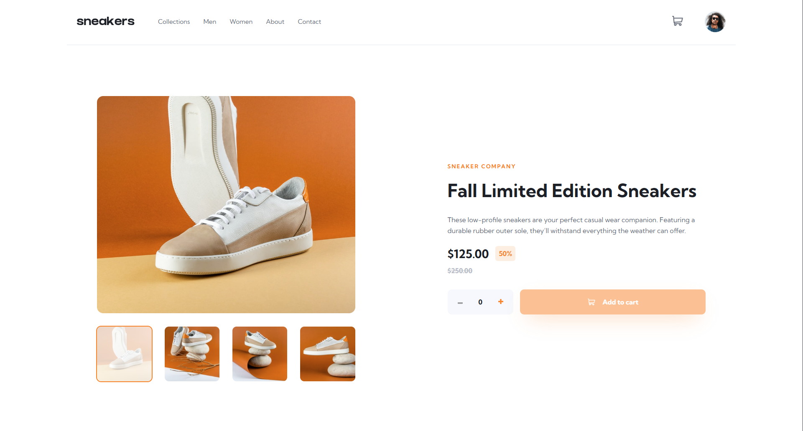
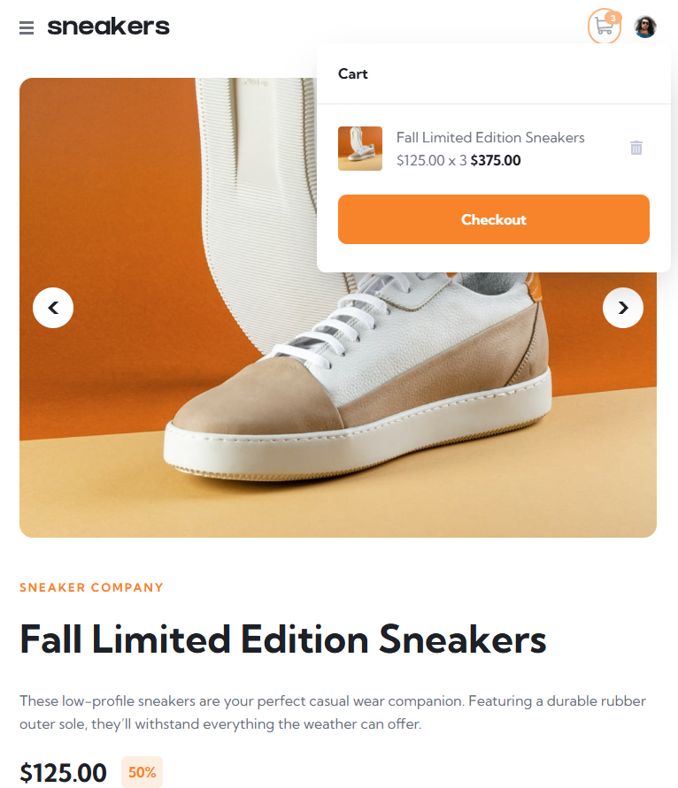
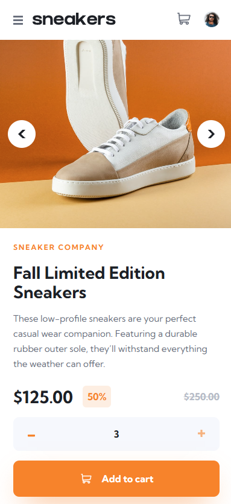

# 👟 Fall Sneakers | Modern E-Commerce Product Page

  
  
  
  

   
   

  
  
  

  

---

## 🚀 About The Project

**Fall Sneakers** is a fully responsive, interactive e-commerce product landing page designed to deliver a premium shopping experience. Designed with a meticulous mobile-first approach, it offers users a seamless flow from browsing product imagery to managing their shopping cart.

Beyond a standard static layout, the application is engineered to provide a tactile and highly responsive user experience. It features hardware-accelerated image swiping, an expanding desktop lightbox modal, and an instantly updating cart state—making the entire shopping journey feel modern, fast, and intuitive.

### 🧠 Key Technical Concepts

This project serves as a comprehensive showcase of modern front-end web development, utilizing the latest framework features and architectural best practices:

- **Modern Angular Reactivity:** Leverages Angular Signals (`signal`, `computed`, `input.required`, `output`) for granular, boilerplate-free state management and instant DOM updates across the application without relying on RxJS.
- **Immutable State Architecture:** Features a dedicated `CartService` that handles complex inventory and cart calculations using strict immutable updates, guaranteeing a bug-free single source of truth.
- **Performant CSS Animations:** Utilizes hardware-accelerated CSS properties (`transform: translateX`, `translate`) to create buttery-smooth image carousel sliding and spring-physics cart dropdown entrances.
- **Smart Component Reusability:** Architected with modularity in mind. The complex `ImageCarousel` component seamlessly adapts its layout and functionality to act as both an inline product viewer and a floating Desktop Lightbox modal.
- **Advanced SCSS & Accessibility:** Features a robust styling foundation using CSS Custom Properties (variables) and nested syntax. Implements strict accessibility (a11y) standards, including precise `:focus-visible` outlines and `inert` attribute handling for off-canvas mobile menus.

---

## 📱 Visual Showcase

> **Note:** Because this app features rich transitions and interactive states, a live demo is highly recommended to experience the UI!

 
  <h3>Desktop Experience & Lightbox</h3>
  

 

  <h3>Responsive & Mobile Views</h3>

<table align="center" style="border: none; background-color: transparent;">
  <tr align="center">
    <td><b>Cart Interactions</b></td>
    <td><b>Mobile View & Nav</b></td>
  </tr>
  <tr align="center" valign="top">
    <td>
      
    </td>
    <td>
      
    </td>
  </tr>
</table>

---

## 🛠️ Built With

- **[Angular](https://angular.dev/)** - Framework utilizing Standalone Components, Signals, and the modern Control Flow syntax (`@if`, `@for`).
- **[TypeScript](https://www.typescriptlang.org/)** - For strict typing of the Product data models and e-commerce cart logic.
- **[SCSS / SASS](https://sass-lang.com/)** - Utilizing scoped component styling, robust `:host` selectors, and global CSS variables.
- **CSS Grid & Flexbox** - Creating a robust, mobile-first layout that scales elegantly to 1440px desktop screens.
